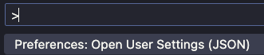

# arquietura-hexagonal

### camadas

- Domain
- Application
- Adapters

### Função das camadas

- **Domain**: Contrato, camada na qual o desenvolvedor deve descrever toda regra de negócio, deve construir o contrato (interface), não deve ter nenhuma dependência de bibliotecas externas, deve ser completamente agnóstica.

- **Application**: Deve conter a implementação dos casos de uso descritos na camada domain, se atentando para a injecão de dependência de bibliotecas.

- **Adapters**: É a camada na qual a aplicação se comunica com o mundo externo, seja, endpoints, menssageria, mobile etc, a informação chega por essa camada e é processada pela Application, camada de casos de uso.

#### Pontos para se atentar

A comunicação das camadas é sempre de fora para dentro, Adapters -> Application -> Domain(Core)

#### (EXTRA) Formatador Python

Podemos configurar o VScode para formatar o código python automaticamente, usando a extensão **Ruff** e a extensão **Too Long - line limit**
<br>
Após instalar as duas extensões abra o documento de configuração do usuário de seu VSCode:

- Macbook: cmd + shift + p
- Windows: control + shift + p

Pesquisar por settings.json >> Open User Settings (JSON) <br>

<br>
Copie e cole as configurações abaixo para ativar tanto o Ruff, quanto o too long line: <br>

```
"[python]": {
  "editor.formatOnType": true,
  "editor.defaultFormatter": "charliermarsh.ruff",
  "editor.formatOnSave": true,
  "editor.codeActionsOnSave": {
    "source.organizeImports": "explicit"
  }
},
"too-long-line-limit.hardLimit": 140,
"too-long-line-limit.softLimitSeverity": "3",
"editor.rulers": [
  80,
  140
]
```

Se necessário faça um reload de seu VScode e pronto, ele irá ajustar seu código automaticamente.
